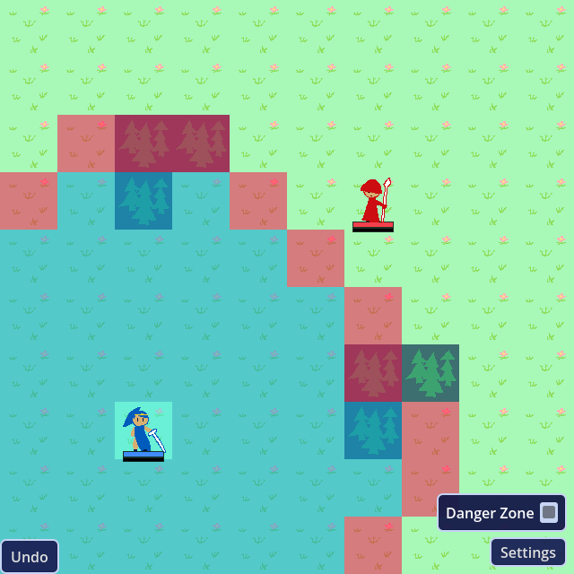

# feclone

A grid-based tactics game in the Fire Emblem tradition, built in Godot 4
with GDScript.



You lead a small squad across a grid, alternating turns with the enemy
and moving each unit once per turn. Where a unit can go depends on the
terrain *and* on what it is — a cavalier bogs down in a forest that a
pegasus knight flies straight over — and what it can hit depends on the
weapon in its hands, so a bow strikes from two tiles away but can't
defend itself up close. Before you commit to a fight, a forecast lays
out the whole exchange: who hits for how much, and whether the defender
can hit back at all. You can scout the danger before you step into it
too — click any enemy to pin its threat range to the map, and pin
several to see the entire no-go zone at once. And when it goes wrong
anyway, undo isn't one step back: you can browse every move of the
match, turn by turn, and jump to any of them.

## For developers

Levels contain no code and no UI — a level scene is a painted terrain
layer, some placed units, and a few metadata fields, all authored in the
Godot editor and loaded into a persistent game shell. Everything that
can be a table is one: classes, items, weapons, staves, skills, levels,
and defeat conditions are each a registry file with a row per entry, so
adding a tome or a new loss condition is a new row rather than a new
branch.

To run it, open the project in Godot 4.7 and press play, or:

```bash
godot --path .
```

[**DESIGN.md**](DESIGN.md) is the full manual — the code map, how the
systems fit together, how to author a level without programming, and
what's planned but not yet built.

## License

Proprietary. See [LICENSE](LICENSE) — the source is public so it can be
read and evaluated, but it is not open source, and no permission is
granted to copy, modify, or reuse it. The code and the pixel art are
mine and covered by that license; the bundled audio and the default
Godot project icon are third-party works under their own licenses.
